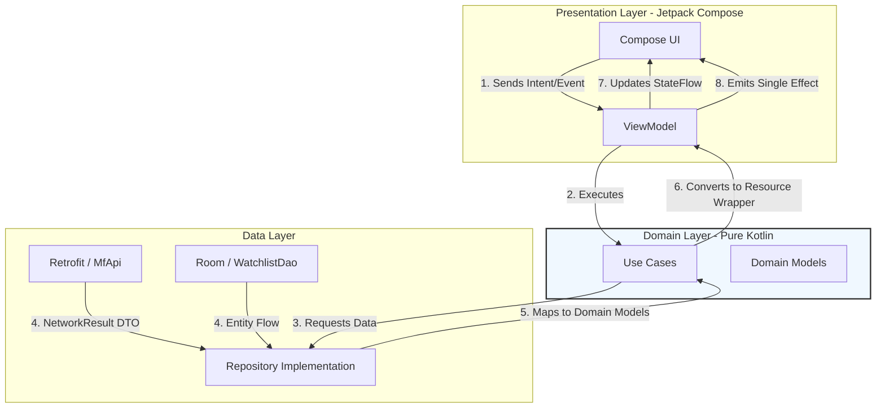
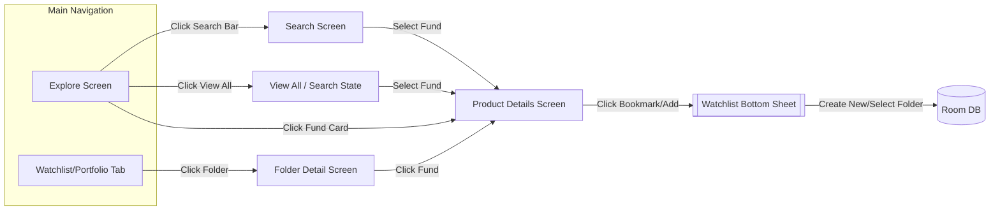

# Mutual Fund Explorer

A native Android application built with **Kotlin** that enables users to discover mutual funds, analyze historical NAV performance through interactive charts, and manage custom offline portfolio watchlists.

This project was developed as part of a **Mobile SDE Intern assignment**, with a strong focus on building a production-ready application using modern Android development practices.

---

## Submission Details

* **GitHub Repository:** https://github.com/Ad12-Ad/Groww-Assignment

* **Screen Recording Video:** https://drive.google.com/file/d/1gkF2NCFRtNotixs-ITlNE6mavCsAFxYG/view?usp=sharing

* **Working APK:** https://drive.google.com/file/d/1yCxxZTomPJOwkNvz0Tfpw6ea5qwmY5JC/view?usp=drive_link

---

## Architecture: Clean Architecture + MVI

The application is designed with a strong emphasis on **scalability, maintainability, and testability**. It follows **Clean Architecture principles** combined with the **MVI (Model-View-Intent)** pattern to ensure a predictable and unidirectional data flow.

### Architectural Flow



### Architectural Highlights

* **Clear Separation of Concerns (No Leaky Abstractions):**
  The Data layer handles low-level concerns such as network errors and IO exceptions, exposing results through a `NetworkResult`.
  The Domain layer then maps this into a clean and UI-friendly `Resource<T>` wrapper.
  This ensures that ViewModels remain completely independent of networking or database implementation details.

* **Unidirectional Data Flow:**
  ViewModels act as the **single source of truth**, exposing:

  * `StateFlow` for UI state updates
  * `Channel` for one-time events (e.g., navigation, toasts)

---

## App Navigation Map



---

## Key Features & Technical Decisions

### 1. Concurrent Network Fetching

Since the provided API does not offer a dedicated "Categories" endpoint, the app dynamically generates category data using the search API.
With **Kotlin Coroutines (async/await)**, multiple category requests are executed in parallel, significantly reducing initial loading time.

---

### 2. Flow-Based Search Debouncing

To prevent excessive API calls and race conditions, the search functionality uses:

* `debounce(300ms)`
* `distinctUntilChanged()`
* `mapLatest()`

This ensures that API requests are triggered only after the user pauses typing, improving both performance and efficiency.

---

### 3. Advanced Local Storage (Room Database)

* **Many-to-Many Relationship:**
  A mutual fund can be saved across multiple portfolios using a **composite primary key**.

* **Reactive UI Synchronization:**
  The UI observes database changes in real time using `Flow.combine`, ensuring instant updates without blocking the main thread.

---

### 4. Off-Thread Chart Parsing

Large datasets (historical NAV values) are processed on `Dispatchers.Default`, ensuring smooth UI performance and preventing frame drops.

---

### 5. Enhanced UI/UX Experience

* **Material 3 Pull-to-Refresh** for seamless data updates
* **Dynamic Profit/Loss Indicators** with color-coded visuals (green/red)
* **Modern UI Components** built entirely with Jetpack Compose (cards, chips, rounded CTA buttons)

---

## Tech Stack & Libraries

* **UI:** Jetpack Compose (Material 3), Navigation Compose
* **Dependency Injection:** Dagger Hilt
* **Asynchronous Programming:** Kotlin Coroutines & Flow
* **Networking:** Retrofit, OkHttp, Gson
* **Local Database:** Room
* **Charting:** Vico (Compose-first charting library)
* **Lifecycle:** lifecycle-runtime-compose

---

## How to Run the App

1. Install the latest version of **Android Studio** (Koala or newer recommended)
2. Ensure **JDK 17 or higher** is configured
3. Clone the repository:

```bash
git clone https://github.com/Ad12-Ad/Groww-Assignment.git
```

4. Open the project in Android Studio
5. Allow Gradle to sync and download all dependencies
6. Run the app on:

   * an Android Emulator, or
   * a physical device running API 24 (Android 7.0) or higher

---

## Final Note

This project emphasizes **production-level Android development practices**, including:

* Clean and scalable architecture
* Efficient state management
* Performance optimization
* Reactive and modern UI design

---
